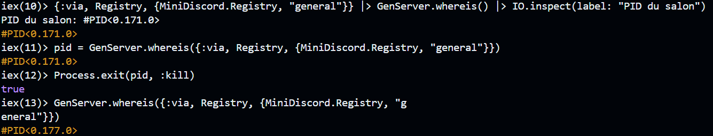
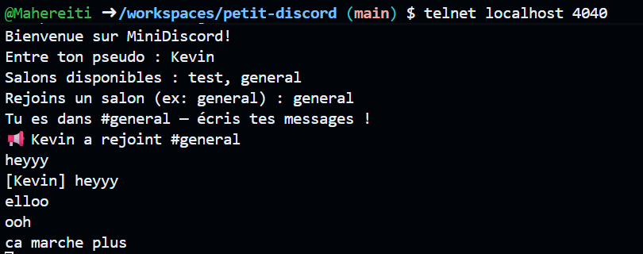

Réponses aux questions :

Phase 1 - GenServer
1.1
  Q1. Pourquoi utilise-t-on Process.monitor/1 dans handle_call({:rejoindre}) ? 
    On utilise Process.monitor dans handle_call pour pouvoir monitorer chaque client et envoyer un message si jamais ils se déconnectenet etc

  Q2. Que se passe-t-il si on n'implémente pas handle_info({:DOWN, ...}) ? 
    Le GenServer peut garder des clients déjà déconnectés (supprimés) dans sa liste de clients

  Q3. Quelle est la différence entre handle_call et handle_cast ? Pourquoi broadcast est un cast ?
    handle_call fait des appels synchrones (avec des réponses) tandis que handle_cast fait des appels asynchrones (pas besoin de réponses). Broadcast est un cast car il n'a pas besoin de réponse (les infos, messages sont juste envoyés à tout le monde).

PHASE 2 - SUPERVISION ET ROBUSTESSE

2.4. Le salon redémarre-t-il après le kill ? Pourquoi ? 
  Oui le salon redémarre automatiquement après le kill (on le sait car son PID change dans la console). 
  
  Cela se fait car le processus du salon est supervisé par un superviseur. Et quand un processus supervisé meurt, le superviseur applique sa stratégie de redémarrage et redémarre automatiquement un même nouveau processus.

  

  Néanmoins on peut voir que si un client était déjà connecté au serveur, et que celui-ci redémarre, le client n'est plus "connecté" (il envoie des messages dans le vide et ne rçoit rien). Et c'est normal étant donné que le salon, malgré qu'il soit pareil, est nouveau (les anciens clients ne sont pas dessus).
  
  

2-5. Quelle est la différence entre les stratégies :one_for_one et :one_for_all ?
  Pour :one_for_one, le processus meurt seul, et est redémarré seul, tandis que pour le :one_for_all, tous les processus meurent, et redémarrent.

